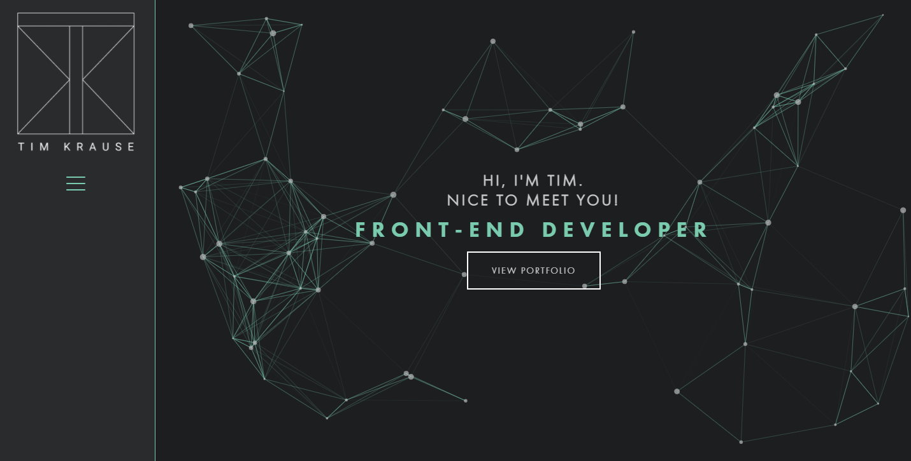

# Portfolio

Source code for my [Personal Website](https://timkrause.dev/), built with [React](https://reactjs.org/).

## Overview

This portfolio is a single page portfolio website created to show both my personal and professional work. My personal work includes the top 3 projects I've completed which show much skills in both the front-end and back-end. The professional work section shows 6 live websites that my team and I have brought to life for our clients, with listed key contributions to each site.

## Technology Used
The technology used to create this portfolio include:

- React
- SASS

## Contact
If you have any questions about the portfolio, my work or if you have any opportunities you would I would be a good fit for. Please contact me through the form at the end of the portfolio.